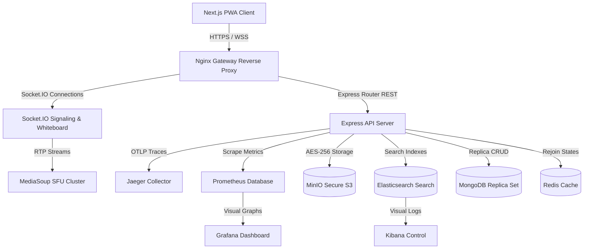
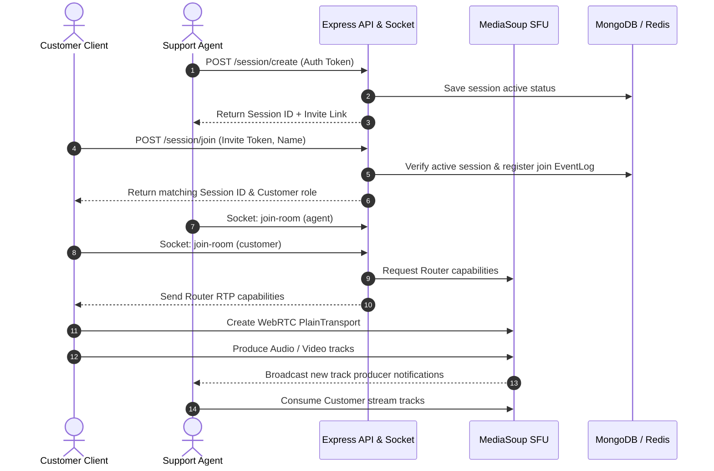
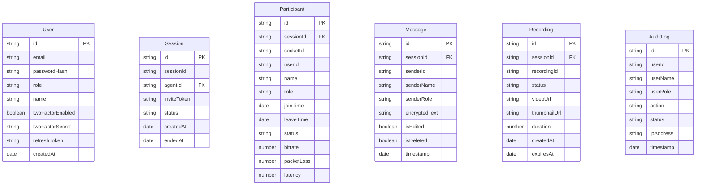
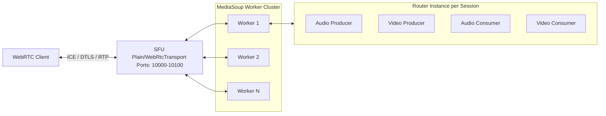

# VisionSupport AI - Enterprise Real-Time Video Support Platform

VisionSupport AI is a production-grade, containerized real-time WebRTC support platform featuring an immersive 3D dashboard. It integrates a MediaSoup SFU, Gemini AI transcript/sentiment analytics, a collaborative whiteboard, AES-256 client-side encrypted S3 uploads, and Prometheus observability telemetry.

---

## 🎨 System Architecture Diagrams

### 1. High-Level Architecture


### 2. End-to-End Session Sequence


### 3. Entity-Relationship (ER) Database Schema


### 4. Socket.IO Real-Time Event Flows

```mermaid
flowchart TD
    Client[Client Browser] <-->|Socket.IO Tunnel| Server[Express Socket Server]
    
    %% Events sent from Client to Server
    Client -->|join-room| Server
    Client -->|send-chat-message| Server
    Client -->|chat-typing| Server
    Client -->|chat-message-reaction| Server
    Client -->|draw-line / draw-shape| Server
    Client -->|whiteboard-clear| Server
    Client -->|cursor-move| Server
    Client -->|mute-participant| Server
    Client -->|takeover-call| Server
    Client -->|private-note| Server

    %% Events broadcasted from Server to Client
    Server -.->|participant-joined| Client
    Server -.->|chat-message| Client
    Server -.->|chat-typing-status| Client
    Server -.->|message-reaction-update| Client
    Server -.->|draw-line-broadcast| Client
    Server -.->|cursor-update| Client
    Server -.->|force-mute-mic| Client
    Server -.->|supervisor-takeover| Client
    Server -.->|private-note-broadcast| Client
```


### 5. MediaSoup WebRTC SFU Routing


---

## 🔧 Environment Variables Configuration

### Backend config (`backend/.env`):
```ini
PORT=5000
MONGODB_URI=mongodb://127.0.0.1:27017/visionsupport
REDIS_URL=redis://127.0.0.1:6379
JWT_SECRET=visionsupport_super_secret_jwt_key
AES_KEY=visionsupport_super_aes_secret_key_32_bytes
GEMINI_API_KEY=your_google_gemini_api_key_here
MINIO_ENDPOINT=127.0.0.1
MINIO_PORT=9000
MINIO_ACCESS_KEY=visionsupport_minio_access_key
MINIO_SECRET_KEY=visionsupport_minio_secret_key
ES_URL=http://127.0.0.1:9200
MEDIASOUP_MIN_PORT=10000
MEDIASOUP_MAX_PORT=10100
```

### Frontend config (`frontend/.env.local`):
```ini
NEXT_PUBLIC_API_URL=http://localhost:5000
NEXT_PUBLIC_SOCKET_URL=http://localhost:5000
```

---

## 🛰️ API Documentation & Specifications

### 🔑 Authentication Tunnels
* **`POST /auth/login`**: Authenticates user using email and password. Returns `twoFactorRequired: true` if MFA is configured.
* **`POST /auth/2fa/verify-login`**: Accepts 2FA validation challenge code and returns short-lived JSON Web Tokens (JWT).
* **`POST /auth/2fa/setup`**: Generates a new TOTP secret string and corresponding Base64 QR-code for authenticator enrollment.
* **`POST /auth/2fa/enable`**: Activates 2FA enforcement flags on the operator's account.
* **`POST /auth/refresh`**: Generates a renewed access token from an active refresh token.

### 📞 Session Registry
* **`POST /session/create`**: Provisions a new session ID and Customer invite link (requires JWT Bearer Token).
* **`POST /session/join`**: Authenticates and assigns guest roles (Customer/Observer) using secure invite tokens.
* **`POST /session/end`**: Flags session as finished and disconnects remaining clients.
* **`GET /session/:sessionId/logs`**: Retrieves event audit timeline records.

### 💾 Secure File Repository
* **`POST /files/upload/chunk`**: Processes resumable drag-and-drop file pieces (2MB chunks).
* **`GET /files/download/:fileId`**: Generates a secure, temporary pre-signed MinIO download URL.

---

## 🚀 Deployment Guide

### 1. Local Dev Setup
Make sure local MongoDB and Redis instances are running (or fallbacks will configure in memory):
```bash
# Start backend
cd backend && npm install && npm run dev

# Start frontend
cd ../frontend && npm install && npm run dev
```

### 2. Docker Compose
Build and containerize the entire stack locally:
```bash
docker-compose up --build
```

### 3. Kubernetes Deployment (Helm)
Apply Helm configuration templates dynamically:
```bash
# Dry run validation
helm template visionsupport ./helm --namespace visionsupport

# Deployment install
helm install visionsupport ./helm --namespace visionsupport --create-namespace
```

---

## 🔍 Troubleshooting Guide

* **MediaSoup Port Allocations:** MediaSoup requires a specific UDP/TCP port range (by default `10000` to `10100`). In container environments like Kubernetes, ensure `hostNetwork: true` is set, or that service configuration mappings bind the full range to host allocations.
* **2FA Drift Errors:** If Google Authenticator codes fail validation, ensure NTP network time synchronization is enabled on the server host.
* **Elasticsearch Startup Delays:** During docker-compose bootstrap, Elasticsearch may require up to 60 seconds to open socket connections. The backend service includes connection-retry policies to prevent container exit.
