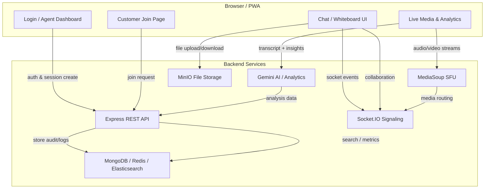
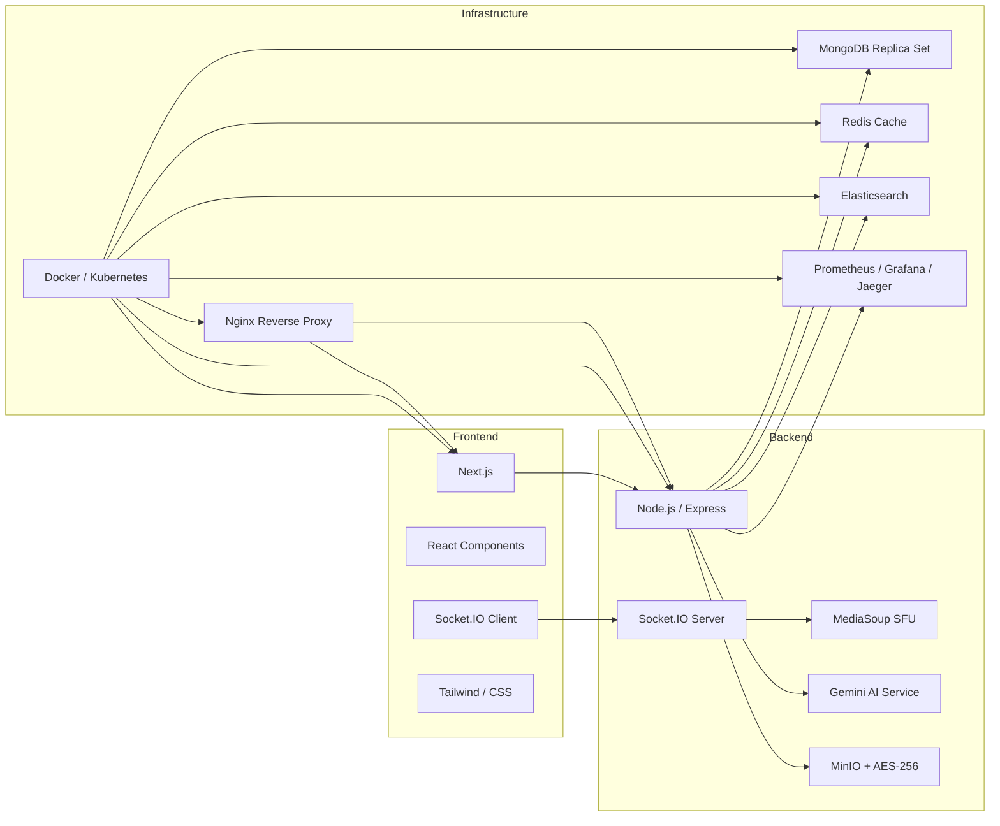

# VisionSupport AI

VisionSupport AI is an enterprise-grade real-time video support platform built for modern customer service teams. It combines WebRTC, AI-powered transcription and analytics, collaborative whiteboarding, secure file handling, and observability tooling in a single containerized project.

## 🚀 What this project includes

- Real-time WebRTC voice/video support using **MediaSoup SFU**
- **Next.js** frontend with a live support dashboard
- **Gemini AI** transcript / sentiment analytics
- **Socket.IO** for chat, presence, and whiteboard sync
- **AES-256 encrypted MinIO uploads** for secure file sharing
- **MongoDB, Redis, Elasticsearch** for persistence and search
- **Prometheus / Grafana / Jaeger** observability and telemetry
- **Docker Compose** and **Helm** deployment manifests

## 🧩 Key Features

- Agent/customer session lifecycle with invite links
- Live chat and file sharing
- Interactive collaborative whiteboard
- End-to-end audio/video streaming over MediaSoup
- Role-based auth and 2FA support
- Audit logging, analytics, and monitoring

## 🏗️ Architecture Overview

This repository is structured as a full-stack platform:

- `backend/` — Express API, Socket.IO signaling, MediaSoup integration, alerting, search, and storage
- `frontend/` — Next.js application for the support dashboard and client experience
- `docker-compose.yml` — Local development container stack
- `helm/` — Kubernetes Helm charts for production deployment
- `k8s/` — Example Kubernetes manifest files

## 🌐 Website Flow



## 🧠 Tech Stack Diagram



## 🧩 Website Modules

- **Authentication:** login, JWT, and 2FA
- **Session Management:** agent invitations, joining guests, and session lifecycle
- **Real-Time Collaboration:** live chat, reactions, whiteboard, and presence signals
- **Media Processing:** audio/video routing through MediaSoup and selective consumer streams
- **AI Analytics:** live transcription, sentiment analysis, and conversation metrics
- **Secure File Sharing:** chunked uploads, encrypted MinIO storage, and signed downloads
- **Monitoring & Observability:** Prometheus metrics, Jaeger traces, and Grafana dashboards

---

## ⚙️ Getting Started

### Local development

1. Install dependencies

```bash
cd backend
npm install
cd ../frontend
npm install
```

2. Start the backend

```bash
cd backend
npm run dev
```

3. Start the frontend

```bash
cd ../frontend
npm run dev
```

### Run with Docker Compose

```bash
docker-compose up --build
```

### Deploy with Helm

```bash
helm template visionsupport ./helm --namespace visionsupport
helm install visionsupport ./helm --namespace visionsupport --create-namespace
```

---

## 🔐 Environment Variables

### Backend (`backend/.env`)

```ini
PORT=5000
MONGODB_URI=mongodb://127.0.0.1:27017/visionsupport
REDIS_URL=redis://127.0.0.1:6379
JWT_SECRET=your_jwt_secret
AES_KEY=your_32_byte_aes_key
GEMINI_API_KEY=your_gemini_api_key
MINIO_ENDPOINT=127.0.0.1
MINIO_PORT=9000
MINIO_ACCESS_KEY=minio_access_key
MINIO_SECRET_KEY=minio_secret_key
ES_URL=http://127.0.0.1:9200
MEDIASOUP_MIN_PORT=10000
MEDIASOUP_MAX_PORT=10100
```

### Frontend (`frontend/.env.local`)

```ini
NEXT_PUBLIC_API_URL=http://localhost:5000
NEXT_PUBLIC_SOCKET_URL=http://localhost:5000
```

---

## 📄 API Summary

### Authentication

- `POST /auth/login` — login with email/password
- `POST /auth/2fa/verify-login` — verify multi-factor authentication
- `POST /auth/refresh` — refresh JWT access tokens

### Sessions

- `POST /session/create` — create a new agent support session
- `POST /session/join` — join an active session via invite token
- `POST /session/end` — end the session cleanly
- `GET /session/:sessionId/logs` — retrieve audit/event logs

### File management

- `POST /files/upload/chunk` — upload file chunks to MinIO
- `GET /files/download/:fileId` — download file securely via signed URL

---

## 📦 Notes

- The frontend is part of the same repository and is not a Git submodule.
- Sensitive values should be kept out of source control and stored in local `.env` files.
- Use the top-level `.gitignore` for local build artifacts and secrets.

---

## 💡 Want to contribute?

1. Fork the repo
2. Create a feature branch
3. Open a Pull Request with a clear summary

---

## 📌 License

This repository does not include a license file. Add one if you want to publish this project publicly.

---

## 🔍 Troubleshooting Guide

- **MediaSoup Port Allocations:** MediaSoup requires a specific UDP/TCP port range (by default `10000` to `10100`). In container environments like Kubernetes, ensure `hostNetwork: true` is set, or that service configuration mappings bind the full range to host allocations.
- **2FA Drift Errors:** If Google Authenticator codes fail validation, ensure NTP network time synchronization is enabled on the server host.
- **Elasticsearch Startup Delays:** During docker-compose bootstrap, Elasticsearch may require up to 60 seconds to open socket connections. The backend service includes connection-retry policies to prevent container exit.
